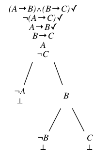

# WylDSL
WylDSL is a domain-specific language for typesetting simple tableau trees.

## Installation
Clone this repository.
Note that this project is written in Python 3.

If you use pip, you can simply run
```
pip install -r requirements.txt
```
You will also need to install graphviz.
See their [installation guide](http://graphviz.org/Download..php).

## Usage
### Describing the tree's structure
Create a text file (e.g. tree.wyl), where you will describe the tree.
The beginning of each node is denoted by a sequence of `>` symbols.
The number of `>` symbols in the sequence represent the depth of the node.

Children of a node is one layer deeper than their parent and must be placed immediately after their parent, not after a node of the same depth as their parent.
The placement is better described with an example.
We can start constructing a tree represented the root node *A*.
```
> A
```
*A*'s children, would be one level deeper than *A*.
To convey that *A* has two children *B* and *C*, we write
```
> A
>> B
>> C
```

Now suppose that *B* has children *D* and *E*.
To specify that they are *B*'s children, we place *D* and *E* between *B* and *C*
```
> A
>> B
>>> D
>>> E
>> C
```
If they were *C*'s children, we would write
```
> A
>> B
>> C
>>> D
>>> E
```

### Symbols
The end of a line within a node is denoted by a semicolon.
There are predefined symbols

| Symbol | Key     |
|:------:|---------|
|   ✓    | check   |
|   →    | implies |
|   ↔    | iff     |
|   ∃    | exists  |
|   ∧    | and     |
|   ∨    | or      |
|   ∀    | forall  |
|   ¬    | not     |
|   ⊥    | bottom  |
|   ⊤    | top     |

The symbols can be invoked by writing `$<key>`.
So `$check` results in ✓.

Writing unicode characters in the text file also works for symbols.

#### User-defined symbols
The symbols must be defined at the start of the file, before the description of the tree.
Define your own symbols by writing
```
use <symbol> for $<key>
```
Here, `<symbol>` could be a unicode character or an HTML code.
For example,
```
use ∑ for $sum
```
With HTML code,
```
use &#8721; for $sum
```

To override existing keys, use the keyword instead.
For example
```
use ⇒ for implies instead
```

### Example
The code
```
>(A$implies B) $and (B $implies C)$check;
 $not (A $implies C)$check;
 A $implies B$check;
 B $implies C;
 A;
 $not C
 >>$not A;
   $bottom
 >>B
   >>>$not B;
      $bottom
   >>>C;
      $bottom
```
describes the following tree



### Drawing the tree
Make sure to use the command that runs Python 3 and not Python 2.
Here, `python` is assumed to run Python 3.
To draw the tree described in `[filename]`, run
```
python drawtableau.py [filename]
```
To name the resulting image, run
```
python drawtableau.py [filename] -o [image name]
```
For example,
```
python drawtableau.py example/implies.wyl -o implies
```
To see more options, run
```
python drawtableau.py -h
```
